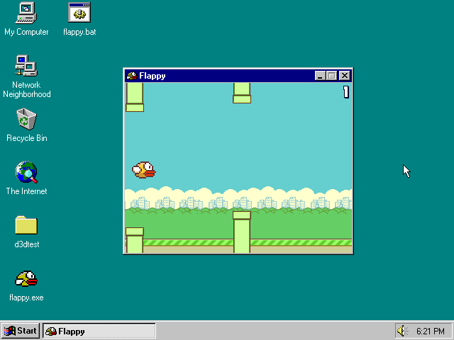

## Flappy

A very simple and stupid flappy bird game in C++ with no game engine.

### System requirements

- Intel Pentium 90Mhz
- 8Mb of RAM
- Windows 95
- DirectX 6.0
- SVGA card supporting 8bpp color mode

### Keys

- Flap/start game: SPACE or Mouse Left
- Zoom out: F6 or Mouse wheel up
- Zoom in: F7 or Mouse wheel down
- Fullscreen: ALT+ENTER or F5
- Exit: ESCAPE

